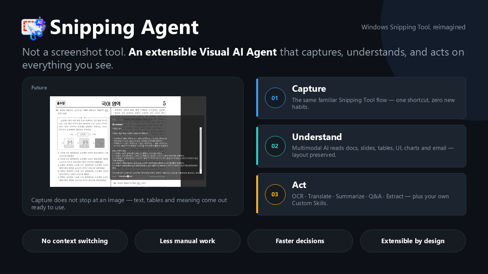

# Snipping Agent

**Snipping Agent** transforms the familiar Windows Snipping Tool into an
AI-powered visual agent that does far more than capture screenshots. Instead of
simply saving images, Snipping Agent instantly understands the content on your
screen and helps you take action without switching between multiple
applications.

## Challenge

Millions of users rely on Snipping Tool every day for screen capture, but
today's experience stops at image creation. Users often need to:

- Preserve document formatting and layouts
- Translate captured content
- Summarize complex information
- Ask questions about what they captured
- Convert screenshots into actionable business content

Today, these tasks typically require additional AI assistants or manual
copy-and-paste workflows, creating unnecessary friction and productivity loss.

## Solution

Snipping Agent introduces a **Capture -> Understand -> Act** experience directly
within the familiar Snipping Tool workflow.

### Built-in skills

Leveraging multimodal AI, Snipping Agent understands:

- Documents and reports
- Presentations and slides
- Tables and spreadsheets
- UI screens and enterprise applications
- Diagrams and charts
- Emails and conversations

Unlike traditional OCR solutions, Snipping Agent preserves document structure,
layout, and context while extracting meaningful information.

### Intelligent capabilities

- Advanced OCR with layout preservation
- Translation across multiple languages
- Context-aware summarization
- Interactive Q&A on captured content
- Insight generation and analysis
- Structured data extraction

The most powerful aspect of Snipping Agent is its extensibility. Beyond built-in
AI capabilities, users can attach their own **Custom Skills** that enable
user-specific intelligence.

## Impact

- Eliminate context switching
- Reduce manual work
- Accelerate decision making
- Democratize AI-powered visual intelligence
- Extend value through custom skills

For detailed application behavior, project structure, build instructions, and
test guidance, see the
[Features and development guide](./docs/FEATURES_AND_DEVELOPMENT.md).